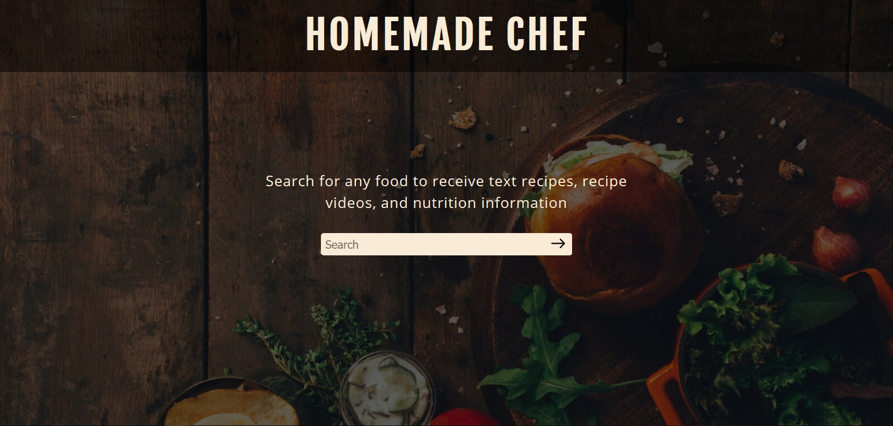
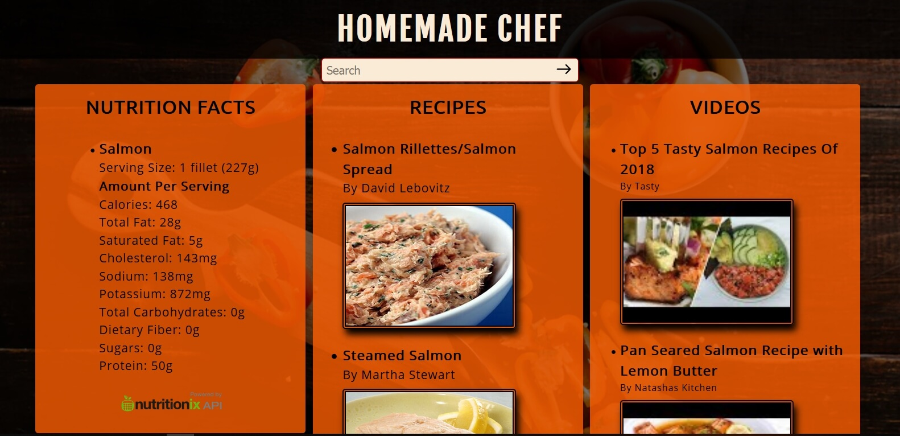

<h1>Homemade Chef App</h1>

<h2>Live Site:</h2>

<ul>
    <li><a href="https://wesmc10.github.io/homemade-chef/" target="_blank">Homemade Chef App</a></li>
</ul>

<h2>Screenshots</h2>

Landing Page

Results Page

<h2>Motivation</h2>

Everyone needs to eat, and most people need to cook at least some of the time. I wanted to make an app so 
that people could have, in one place, all the information they need to determine what to cook and how to cook it.

<h2>Summary</h2>

This app allows users to search for any type of food that they would like to make, and returns nutrition 
information for that food, along with links to the most popular text recipes and recipe videos for that food.

<h2>Technologies Used</h2>

<ul>
    <li>HTML</li>
    <li>CSS</li>
    <li>JavaScript</li>
    <li>jQuery</li>
</ul>